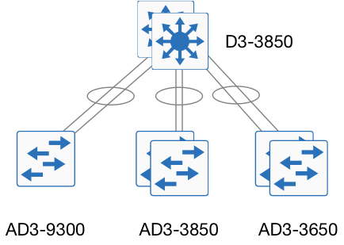

Cisco IOS-XE Automation via NETCONF
===================================

The objective of this README is to provide documentation for the playbooks related to Cisco's [Campus LAN Layer 2 Access with Simplified Distribution Deployment Guide](https://www.cisco.com/c/dam/en/us/td/docs/solutions/CVD/Oct2015/CVD-Campus_LAN_L2_Access_Simplified_Dist_Deployment-Oct2015.pdf).

## Overview

The methodology relies on NETCONF-YANG models to the extent possible via NETCONF transport.  Please note in the documentation for specific instances where CLI commands had to be used for switch provisioning.  Ansible was chosen as the framework of choice and is the only dependency to run these automation tasks.  This is achieved with the following:

* Ansible Playbooks
* Ansible Roles

Each playbook executes the tasks in a given role based on the procedures defined in the Layer 2 Design Guide.

### Note about zero-touch or power-on provisioning

These playbooks do not handle out-of-box configuration and require a minimum amount of configuration and connectivity to work.  We assume the device can be reached via SSH from the Ansible server and that at least one admin (privilege 15) account is present.  It is highly recommended that HA and VSS configuration be done ahead of time as part of the bootstrap configuration as well.

### Getting Started with Ansible and IOSXE with NETCONF

For instructions on how to quickly get Ansible setup on your local machine with the necessary NETCONF libraries, you can use [this readme](../../ansible-setup.md). For instructions on how to get your IOS-XE device setup for NETCONF, you can use [this readme](../../iosxe-netconf-setup.md).

## Tested Topology

| Hostname | Device information |
| -------- | ------------------ |
| D3-3850 | WS-C3850 stacked distribution switch. |
| AD3-9300 | C9300 standalone access switch. |
| AD3-3850 | WS-C3850 stacked access switch. |
| AD3-3650 | WS-C3650 stacked access switch. |



## Tested platorms and software

| Platform      | PID                     | Software                                  |
| ------------- | ----------------------- | ----------------------------------------- |
| Catalyst 9000 | C9300-48U               | CAT9K_IOSXE Version 16.6.2                |
| Catalyst 3850 | WS-C3850-12X48U         | CAT3K_CAA-UNIVERSALK9-M Version 16.6.2    |
| Catalyst 3850 | WS-C3850-24XU           | CAT3K_CAA-UNIVERSALK9-M Version 16.6.2    |
| Catalyst 3850 | WS-C3850-24XS           | CAT3K_CAA-UNIVERSALK9-M Version 16.6.2    |
| Catalyst 3650 | WS-C3650-48PS           | CAT3K_CAA-UNIVERSALK9-M Version 16.6.2    |


## Playbooks

| Playbook Name | Description |
| ------------- | ------------------- |
| `deploy-full-l2cvd.yml` | Aggregate playbook that runs all procedures in the Design Guide. |
| `access-layer-tasks.yml` | Aggregate playbook that runs procedures associated only with the access-layer switches. |
| `distribution-layer-tasks.yml` | Aggregate playbook that runs procedures associated only with the distribution-layer switches. |
| `access_procedure_n.yml` | Calls roles necessary to complete Procedure n from the Design Guide where "n" is a procedure number. These playbooks only configure access-layer switches. |
| `distribution_procedure_n.yml` | Calls roles necessary to complete Procedure n from the Design Guide where "n" is a procedure number. These playbooks only configure distribution-layer switches.|

### Sample commands

These can be run:
* with the `-i inventory` option
* `export ANSIBLE_INVENTORY=/path/to/inventory`
* In ansible.cfg:
    ```
    [defaults]
    inventory=/path/to/inventory
    ```
The playbooks are designed to be run without any additional arguments other than the playbook name.  To run all procedures against all devices, enter the command:  
    ansible-playbook deploy-full-l2cvd.yml  

Access or distribution playbooks can be run in the same way, without any additional arguments, as follows:  
    ansible-playbook access_procedure_1.yml  

| Playbook | Notes |
| -------- | ----- |
| deploy-full-l2cvd.yml | Runs all procedures for all layers. |
| access-layer-tasks.yml | Runs all access layer procedures. |
| access_procedure_1.yml | |
| access_procedure_2.yml | |
| access_procedure_3.yml | |
| access_procedure_4.yml | |
| access_procedure_5.yml | |
| distribution-layer-tasks.yml | Runs all distribution layer procedures. |
| distribution_procedure_1.yml | |
| distribution_procedure_2.yml | |
| distribution_procedure_3.yml | |
| distribution_procedure_4.yml | |
| distribution_procedure_5.yml | |
| distribution_procedure_6.yml | |
| distribution_procedure_7.yml | |
| distribution_procedure_8.yml | |

### Variables

The playbooks are designed to run in a single distribution "domain" where all vlans are unique to this [layer-2] domain.  

`group_vars/all.yml`:  

    # Authenticaion data.
    # Use this method if credentials are per host, otherwise you may specify domain-wide credentials here.
    provider:
      host: "{{ ansible_host }}"
      username: "{{ ansible_user }}"
      auth_pass: "{{ ansible_ssh_pass }}"
      password: "{{ ansible_ssh_pass }}"
      timeout: 120
    enable_secret: C1sco123
    snmp_read_only_name: snmpro
    snmp_read_write_name: snmprw
    # Local directory or fully-qualified path to the folder where as-built configuration snippets will be stored.
    configs_dir: "./configs"
    tacacs_server_group_name: TACACS-SERVERS
    tacacs_server:
      name: TACACS-SERVER-1
      ipv4_addr: 10.4.48.15
      tacacs_key: tacman
    local_auth_accounts:
      - username: admin
    	password: C1sco123
    	privilege_level: 15
      - username: jacob
    	password: jacob
    	privilege_level: 15
    
    domain_name: cisco.local
    active_directory_server: 10.4.48.10
    dns_server: 10.4.48.10
    # For relaying
    dhcp_server: 10.4.48.10
    
    # This is the subnet where access-layer in-band SVI's live.
    management_subnet: 10.4.95.0/25
    management_acl_subnets:
      - 10.4.95.0/24
      - 100.0.0.0/8
    
    # **Optional**
    # Please refer to the CVD for details.
    oob_subnet: 172.16.33.0/25
    
    # NTP and clock settings
    ntp_server: 10.4.48.17
    clock_timezone: "PST"
    clock_offset: "-8"
    clock_summer_time: PDT
    
    # **Optional**
    # The CVD doesn't mention it explicitly, but these would need to be setup *per data*
    # VLAN below.  A realistic deployment would require tweaking the data model.
    dhcp_server_subnet: 192.0.0.0/25
    dhcp_excl_low: 192.0.0.1
    dhcp_excl_high: 192.0.0.10
    
    # In-band access-layer management vlan.  This is the SVI that will be created on the access-layer switches.
    mgmt_vlan: 195
    # Anti-vlan-hopping vlan ID.
    anti_vlan_hop: 999
    
    # List of VLAN's for this layer-2 domain.  All three keys *must* be filled out for each vlan.
    vlan_data:
      180:
    	vlan_desc: Data-Sw1
    	vlan_name: wired_data
    	ipv4_network: 10.4.80.0/24
      181:
    	vlan_desc: Voice-Sw1
    	vlan_name: wired_voice
    	ipv4_network: 10.4.81.0/24
    
    # Routing protocol.  EIGRP or OSPF, mutually exclusive.
    eigrp_auth:
      name: EIGRP-KEY
      keys:
    	- id: 1
    	  secret: C1sco123
    ospf_auth:
      name: OSPF-KEY
      keys:
    	- id: 1
    	  secret: C1sco123
    # Options: pagp, lacp, force
    etherchannel_protocol: lacp

Distribution-switch host variables  
`host_vars/D3-3850.yml`:  

	# Model string
	model: 3850
	loopback0: 10.4.95.254
	loopback1: 10.4.95.253
	multicast_network: 239.1.0.0/16
	# routing_protocol: 'eigrp' or 'ospf'
	routing_protocol: eigrp
	rendezvous_networks:
	  - 10.4.40.0/24
	  - 10.4.48.0/24
	multicast_source_networks:
	  - 10.4.40.0/24
	eigrp:
	  name: LAN
	  as: 100
	  # Advertised in `network` statements
	  networks:
		- 10.4.0.0/20
		- 10.4.0.0/15
	  summaries:
		- 10.4.0.0/19
	# Mutually exclusive.  Each protocol takes slightly different keys.
	ospf:
	  id: 100
	  networks:
		- ipv4_network: 10.4.0.0/20
		  area: 40
		- ipv4_network: 10.4.40.0/24
		  area: 0
	  summaries:
		- area: 40
		  ipv4_network: 10.4.0.0/19
	port_channels:
	  # Currently, only `routed_uplink` or `access_downlink` types are supported
	  #
	  #   id|int:
	  #   type: routed_uplink
	  #   ipv4_addr: str|required
	  #   interfaces: list|required
	  #     - string
	  #   id|int:
	  #   type: access_downlink
	  #   member_vlans: list|required
	  #     - int
	  #   interfaces: list|required
	  #     - string
	  #
	  - id: 1
		type: access_downlink
	    # Name of access-layer neighbor used in port description
		access_nei: AD3-4507-1
		member_vlans:
		  - "{{ mgmt_vlan }}"
		  - 180
		  - 181
		interfaces:
		  - TenGigabitEthernet1/0/1
		  - TenGigabitEthernet1/0/2
	  - id: 34
	    # This is a layer-3 port channel
		type: routed_uplink
		ipv4_addr: 10.4.40.18
		interfaces:
		  - TenGigabitEthernet1/1/3
		  - TenGigabitEthernet1/1/4
	# Indicates upstream links to core or WAN layer
	uplinks:
	  - interface: Port-channel34
	# **Optional**
	# See CVD for details
	oob_interface:
	  interface: GigabitEthernet1/0/32
	  ipv4_addr: 172.16.33.4
	# These are *untested*!
	# dist_ha_option:
	#   1: Convert Cisco Catalyst 6807-XL, 6500-E, 6880-X, 4500E, and 4500-X to Virtual Switching System using Easy-VSS
	#   2: Configure Cisco Catalyst 6807-XL, 6500-E, or 6880-X Virtual Switching System
	#   3: Configure Cisco Catalyst 4500E VSS and 4500-X VSS platforms
	#   4: Configure the Cisco Catalyst 3850 platform
	dist_ha_option: 4

### Adding an access switch

1. Add the device to the `inventory` file under the `access` section.  `ansible_host` is the IPv4 address of the device, otherwise DNS is attempted based on the device name.
    ```
    [access]
    AD3-3650 ansible_host=100.119.112.254
    ```

2. Fill out the host variables.  You may copy one of the other access-switch host variable files to speed up the process.

    `host_vars/D3-3650.yml`:  

        model: 3650
        # IPv4 address of the management SVI
        inband_mgmt_address: 10.4.95.7
        # Each access switch has a data and voice vlan.  Subnet and description are in `group_vars/all.yml`.
        data_vlan: 184
        voice_vlan: 185
        # These have to be indicated by module/card/port.  Dashes, but no commas, may be used to indicate ranges.
        access_ports:
          - name: GigabitEthernet
            module: 1
            card: 0
            ports: 1-30
          - name: GigabitEthernet
            module: 2
            card: 0
            ports: 1-30
        # Channel protocol is set in `group_vars/all.yml`.
        port_channels:
          3:
            type: uplink
            interfaces:
              - GigabitEthernet1/1/1
              - GigabitEthernet1/1/2
        uplinks:
          - interface: Port-channel3
        # **Optional**
        # If the switch is to configured in a stack, priorities need to be indicated here.
        stack_config:
          - switch_id: 1
            priority: 1
          - switch_id: 2
            priority: 15
          - switch_id: 3
            priority: 14

## Roles

This is a list of roles along with a description of each.  Varibales that need to be set per each environment are indicated below.

| Role Name       | `access_ports_aging_security` |
| ------------------- | --------------------------- |
| Description | Set an aging time to remove learned MAC addresses from the secured list. |
| Variables | <ul> <li> `access_ports` </li> </ul> |

| Role name | `access_ports_host` |
| ------------------- | --------------------------- |
| Description | Optimize the interface for device connectivity by applying the switchport host command. **CLI task** |
| Variables | <ul> <li> `access_ports` </li> </ul> |

| Role name | `access_ports_load_interval` |
| ------------------- | --------------------------- |
| Description | Reduce the length of time used for computing interface load average statistics. |
| Variables | <ul> <li> `access_ports` </li> </ul> |

| Role name | `access_ports_mac_security` |
| ------------------- | --------------------------- |
| Description | Configure 11 MAC addresses to be active on the interface at one time. |
| Variables | <ul> <li> `access_ports` </li> </ul> |

| Role name | `access_ports_mls` |
| ------------------- | --------------------------- |
| Description | Increase the buffers for the default queue on 2960-X. **CLI task** |
| Variables | <ul> <li> None </li> </ul> |

| Role name | `access_ports_nd_security` |
| ------------------- | --------------------------- |
| Description | Attach the IPv6 First Hop Security policy to the interface. |
| Variables | <ul> <li> `access_ports` </li> </ul> |

| Role name | `access_ports_snooping` |
| ------------------- | --------------------------- |
| Description | Configure DHCP snooping. |
| Variables | <ul> <li> `access_ports` </li> </ul> |

| Role name | `access_ports_source_guard` |
| ------------------- | --------------------------- |
| Description | Configure IP Source Guard on the interface. |
| Variables | <ul> <li> `access_ports` </li> </ul> |

| Role name | `access_ports_violation_security` |
| ------------------- | --------------------------- |
| Description | Configure the restrict option to drop traffic from MAC addresses that are in violation. |
| Variables | <ul> <li> `access_ports` </li> </ul> |

| Role name | `access_ports_vlan` |
| ------------------- | --------------------------- |
| Description | Configure switch interfaces to support clients and IP phones. |
| Variables | <ul> <li> `access_ports` </li> <li> `data_vlan` </li> <li> `voice_vlan` </li> </ul> |

| Role name | `anti_vlan_hopping` |
| ------------------- | --------------------------- |
| Description | Configure an unused VLAN on all switch-to-switch 802.1Q trunk links from access layer to distribution layer. |
| Variables | <ul> <li> `access_ports` </li> <li> `anti_vlan_hop` </li> </ul> |

| Role name | `apply_macro` |
| ------------------- | --------------------------- |
| Description | Enable QoS by applying the access edge QoS macro that was defined in the platform configuration procedure. **CLI task** |
| Variables | <ul> <li> `access_ports` </li> <li> `uplinks` </li> <li> `port_channels` </li> </ul> |

| Role name | `arp_inspection` |
| ------------------- | --------------------------- |
| Description | Configure ARP inspection on the data and voice VLANs. |
| Variables | <ul> <li> `access_ports` </li> <li> `data_vlan` </li> <li> `voice_vlan` </li> </ul> |

| Role name | `bpdu_guard` |
| ------------------- | --------------------------- |
| Description | Configure the Bridge Protocol Data Unit (BPDU) Guard global setting to protect PortFast-enabled interfaces. |
| Variables | <ul> <li> None </li> </ul> |

| Role name | `dhcp_server` |
| ------------------- | --------------------------- |
| Description | Provide DHCP service in IOS by configuring the IOS DHCP server. |
| Variables | <ul> <li> `dhcp_server_subnet` </li> <li> `dhcp_excl_low` </li> <li> `dhcp_excl_high` </li> </ul> |

| Role name | `dhcp_snoop_access` |
| ------------------- | --------------------------- |
| Description | Configure DHCP snooping and ARP inspection on the interface to process 100 packets per second of traffic on the port. |
| Variables | <ul> <li> `access_ports` </li> </ul> |

| Role name | `dhcp_snoop_global` |
| ------------------- | --------------------------- |
| Description | Configure DHCP snooping and enable it on the data and voice VLANs. |
| Variables | <ul> <li> `data_vlan` </li> <li> `voice_vlan` </li> </ul> |

| Role name | `dhcp_snoop_trunk` |
| ------------------- | --------------------------- |
| Description | Configure the VLAN trunk interface to the upstream device. |
| Variables | <ul> <li> `uplinks` </li> </ul> |

| Role name | `distribution_l2vlans` |
| ------------------- | --------------------------- |
| Description | Configure all VLANs for the access layer switches that you are connecting to the distribution switch. |
| Variables | <ul> <li> `vlan_data` </li> </ul> |

| Role name | `distribution_portchannel_to_core` |
| ------------------- | --------------------------- |
| Description | Configure the Layer 3 interface. **CLI task** |
| Variables | <ul> <li> `uplinks` </li> <li> `port_channels` </li> </ul> |

| Role name | `distribution_ports_ospf` |
| ------------------- | --------------------------- |
| Description | If the routing protocol you are using is OSPF, you add the router neighbor authentication configuration to the interface. |
| Variables | <ul> <li> `port_channels` </li> <li> `ospf_auth` </li> </ul> |

| Role name | `distribution_ports_to_core` |
| ------------------- | --------------------------- |
| Description | Configure the Layer 3 interface. **CLI task** |
| Variables | <ul> <li> `uplinks` </li> <li> `port_channels` </li> </ul> |

| Role name | `dns` |
| ------------------- | --------------------------- |
| Description | Configure DNS for host lookup. |
| Variables | <ul> <li> `dns_server` </li> </ul> |

| Role name | `eigrp` |
| ------------------- | --------------------------- |
| Description | Enable EIGRP named mode for the IP address space that the network will be using. **CLI task** |
| Variables | <ul> <li> `eigrp` </li> <li> `loopback0` </li> </ul> |

| Role name | `eigrp_authentication` |
| ------------------- | --------------------------- |
| Description | Configure router neighbor authentication. |
| Variables | <ul> <li> `eigrp` </li> </ul> |

| Role name | `eigrp_summary` |
| ------------------- | --------------------------- |
| Description | Configure IP address summarization on the links to the core. |
| Variables | <ul> <li> `access_ports` </li> </ul> |

| Role name | `errdisable` |
| ------------------- | --------------------------- |
| Description |Enable the recovery mechanism to allow ports disabled as a result of errors to automatically clear the err-disable status and attempt a recovery to operational behavior and connected status.  |
| Variables | <ul> <li> None </li> </ul> |

| Role name | `etherchannel` |
| ------------------- | --------------------------- |
| Description | When connecting to another switch, use two links or a multiple of two links distributed for maximum resiliency. |
| Variables | <ul> <li> `etherchannel_protocol` </li> <li> `uplinks` </li> </ul> |

| Role name | `gateway` |
| ------------------- | --------------------------- |
| Description | Configure the switch with an IP address so that it can be managed via in-band connectivity. |
| Variables | <ul> <li> `model` </li> <li> `management_subnet` </li> </ul> |

| Role name | `hostname` |
| ------------------- | --------------------------- |
| Description | Configure the device hostname to make it easy to identify the device. |
| Variables | <ul> <li> `inventory_hostname` </li> </ul> |

| Role name | `ip_mroute_disc_rp` |
| ------------------- | --------------------------- |
| Description | Configure the switch to discover the IP Multicast RP. |
| Variables | <ul> <li> None </li> </ul> |

| Role name | `ip_mroute_global` |
| ------------------- | --------------------------- |
| Description | Configure IP Multicast routing on the platforms in the global configuration mode. |
| Variables | <ul> <li> None </li> </ul> |

| Role name | `ip_pim_sparse_access` |
| ------------------- | --------------------------- |
| Description | Configure ip pim sparse-mode. All Layer 3 interfaces in the network should be enabled for sparse mode multicast operation. |
| Variables | <ul> <li> `port_channels` </li> <li> `vlan_data` </li> </ul> |

| Role name | `l2_portchannel_to_access` |
| ------------------- | --------------------------- |
| Description | Configure the VLAN trunk interface to the access layer. |
| Variables | <ul> <li> `vlan_data` </li>  <li> `uplinks` </li> </ul> |

| Role name | `l3_svi` |
| ------------------- | --------------------------- |
| Description | Configure a VLAN interface (SVI) for every access layer VLAN so devices in the VLAN can communicate with the rest of the network. |
| Variables | <ul> <li> `vlan_data` </li> </ul> |

| Role name | `load_balance_algorithm` |
| ------------------- | --------------------------- |
| Description | Set EtherChannels to use the traffic source and destination IP address when calculating which link to send the traffic across. |
| Variables | <ul> <li> `model` </li> </ul> |

| Role name | `local_login` |
| ------------------- | --------------------------- |
| Description |  |
| Variables | <ul> <li> `local_auth_accounts` </li> <li> `enable_secret` </li> </ul> |

| Role name | `loopback_ip` |
| ------------------- | --------------------------- |
| Description | Configure an in-band management interface. |
| Variables | <ul> <li> `loopback0` </li> </ul> |

| Role name | `macro` |
| ------------------- | --------------------------- |
| Description | For each platform, define two macros that you will use in later procedures to apply the platform specific QoS configuration. This makes consistent deployment of QoS easier. **CLI task** |
| Variables | <ul> <li> `model` </li> </ul> |

| Role name | `management_interface` |
| ------------------- | --------------------------- |
| Description | Configure the switch with an IP address so that it can be managed via in-band connectivity. |
| Variables | <ul> <li> `mgmt_vlan` </li> <li> `vlan_data` </li> </ul> |

| Role name | `mgmt_acl` |
| ------------------- | --------------------------- |
| Description |  |
| Variables | <ul> <li> `access_ports` </li> </ul> |

| Role name | `mgmt_protocols` |
| ------------------- | --------------------------- |
| Description | Configure device management protocols. |
| Variables | <ul> <li> `domain_name` </li> </ul> |

| Role name | `ntp` |
| ------------------- | --------------------------- |
| Description | Configure a synchronized clock by programming network devices to synchronize to a local NTP server in the network. **CLI task** |
| Variables | <ul> <li> `ntp_server` </li> <li> `clock_timezone` </li> <li> `clock_offset` </li> <li> `clock_summer_time` </li> </ul> |

| Role name | `oob_ip` |
| ------------------- | --------------------------- |
| Description | If you have an out-of-band management network, configure an out-of-band management interface and route to the management network. |
| Variables | <ul> <li> `oob_interface` </li> <li> `oob_subnet` </li> </ul> |

| Role name | `ospf` |
| ------------------- | --------------------------- |
| Description | Enable OSPF for the IP address space that the network will be using. |
| Variables | <ul> <li> `ospf` </li> </ul> |

| Role name | `ospf_authentication` |
| ------------------- | --------------------------- |
| Description | If the routing protocol you are using is OSPF, you add the router neighbor authentication configuration to the interface. |
| Variables | <ul> <li> `ospf` </li> </ul> |

| Role name | `ospf_summary` |
| ------------------- | --------------------------- |
| Description | Configure IP address summarization on the links to the core. **CLI task.** |
| Variables | <ul> <li> `ospf` </li> </ul> |

| Role name | `purge_route` |
| ------------------- | --------------------------- |
| Description | Revert from the latest default routing protocol behavior and enable the traditional Cisco IOS software-based route install and purge behavior |
| Variables | <ul> <li> None </li> </ul> |

| Role name | `ra_guard` |
| ------------------- | --------------------------- |
| Description | Configure the IPv6 First Hop Security global policy for host ports. |
| Variables | <ul> <li> None </li> </ul> |

| Role name | `ra_guard_access` |
| ------------------- | --------------------------- |
| Description | Configure the IPv6 First Hop Security global policy for host ports. |
| Variables | <ul> <li> `access_ports` </li> </ul> |

| Role name | `rendezvous_candidate` |
| ------------------- | --------------------------- |
| Description | Configure AutoRP candidate RP. |
| Variables | <ul> <li> `multicast_network` </li> </ul> |

| Role name | `rendezvous_loopback` |
| ------------------- | --------------------------- |
| Description | Configure loopback interface for RP. |
| Variables | <ul> <li> `loopback1` </li> </ul> |

| Role name | `rendezvous_map` |
| ------------------- | --------------------------- |
| Description | Configure AutoRP mapping agent. **CLI task** |
| Variables | <ul> <li> `rendezvous_networks` </li> </ul> |

| Role name | `rendezvous_rogue` |
| ------------------- | --------------------------- |
| Description | Filter any rogue multicast sources from overloading the router control plane. |
| Variables | <ul> <li> `rendezvous_networks` </li> </ul> |

| Role name | `set_native_vlan` |
| ------------------- | --------------------------- |
| Description |  Configure an unused VLAN on all switch-to-switch 802.1Q trunk links from access layer to distribution layer.|
| Variables | <ul> <li> `uplinks` </li> <li> `anti_vlan_hop` </li> </ul> |

| Role name | `snmp` |
| ------------------- | --------------------------- |
| Description | Enable Simple Network Management Protocol (SNMP) in order to allow the network infrastructure devices to be managed by a Network Management System (NMS), and then configure SNMPv2c both for a read-only and a read-write community string. |
| Variables | <ul> <li> `snmp_read_only_name` </li> <li> `snmp_read_write_name` </li> </ul> |

| Role name | `stack_switch_auto_upgrade` |
| ------------------- | --------------------------- |
| Description | Configure the Cisco Catalyst 3650 or 3850 stack to automatically upgrade the software of new switches introduced into the stack to the level of the active switch, allowing full stack operability. **CLI task** |
| Variables | <ul> <li> None </li> </ul> |

| Role name | `stack_switch_mac_persist` |
| ------------------- | --------------------------- |
| Description | If you are configuring a stack, run the stack-mac persistent timer 0 command. **CLI task** |
| Variables | <ul> <li> None </li> </ul> |

| Role name | `stack_switch_power` |
| ------------------- | --------------------------- |
| Description | If you are using a Cisco Catalyst 3850 with StackPower technology, ensure enough power is available during any power supply failure in order to support the entire stack during the degraded mode of operation, and configure the non-default redundant mode of operation for each switch in the stack. **CLI task** |
| Variables | <ul> <li> `switch` </li> </ul> |

| Role name | `stack_switch_priority` |
| ------------------- | --------------------------- |
| Description | If you are configuring a stack of switches, set the stack master switch. **CLI task** |
| Variables | <ul> <li> `stack_config` </li> </ul> |

| Role name | `stp` |
| ------------------- | --------------------------- |
| Description | Enable Rapid Per-VLAN Spanning-Tree (PVST+). |
| Variables | <ul> <li> None </li> </ul> |

| Role name | `stp_root` |
| ------------------- | --------------------------- |
| Description |  **CLI task** |
| Variables | <ul> <li> `access_ports` </li> </ul> |

| Role name | `switch_redundancy` |
| ------------------- | --------------------------- |
| Description | When a Cisco Catalyst 4507R+E is configured with two Supervisor Engine 7L-E, 7-E, or 8-E modules, configure the switch to use stateful switchover (SSO) when moving the primary supervisor functionality between modules. **CLI task** |
| Variables | <ul> <li> None </li> </ul> |

| Role name | `sys_process_source_iface` |
| ------------------- | --------------------------- |
| Description | Configure the system processes to use the loopback interface address for optimal resiliency. |
| Variables | <ul> <li> None </li> </ul> |

| Role name | `tacacs` |
| ------------------- | --------------------------- |
| Description | If you want to reduce operational tasks per device, configure centralized user authentication by using the TACACS+ protocol to authenticate management logins on the infrastructure devices to the authentication, authorization and accounting (AAA) server. |
| Variables | <ul> <li> `tacacs_server` </li> <li> `tacacs_server_group_name` </li> </ul> |

| Role name | `trunk_uplink` |
| ------------------- | --------------------------- |
| Description | Configure the VLAN trunk interface to the upstream device. |
| Variables | <ul> <li> `uplinks` </li> </ul> |

| Role name | `udld` |
| ------------------- | --------------------------- |
| Description | Enable Unidirectional Link Detection (UDLD) as the default for fiber ports. |
| Variables | <ul> <li> `access_ports` </li> </ul> |

| Role name | `vlans` |
| ------------------- | --------------------------- |
| Description | Configure VLANs. |
| Variables | <ul> <li> `data_vlan` </li> <li> `voice_vlan` </li> <li> `mgmt_vlan` </li> <li> `anti_vlan_hop` </li> </ul> |

| Role name | `vss` |
| ------------------- | --------------------------- |
| Description | Configure the platform. **CLI task** |
| Variables | <ul> <li> `dist_ha_option` </li> </ul> |

| Role name | `vtp` |
| ------------------- | --------------------------- |
| Description | If the switch VTP mode has been changed from default, configure VTP transparent mode. |
| Variables | <ul> <li> None </li> </ul> |

